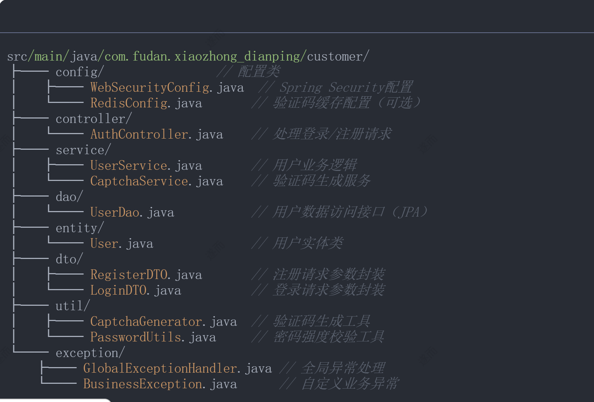
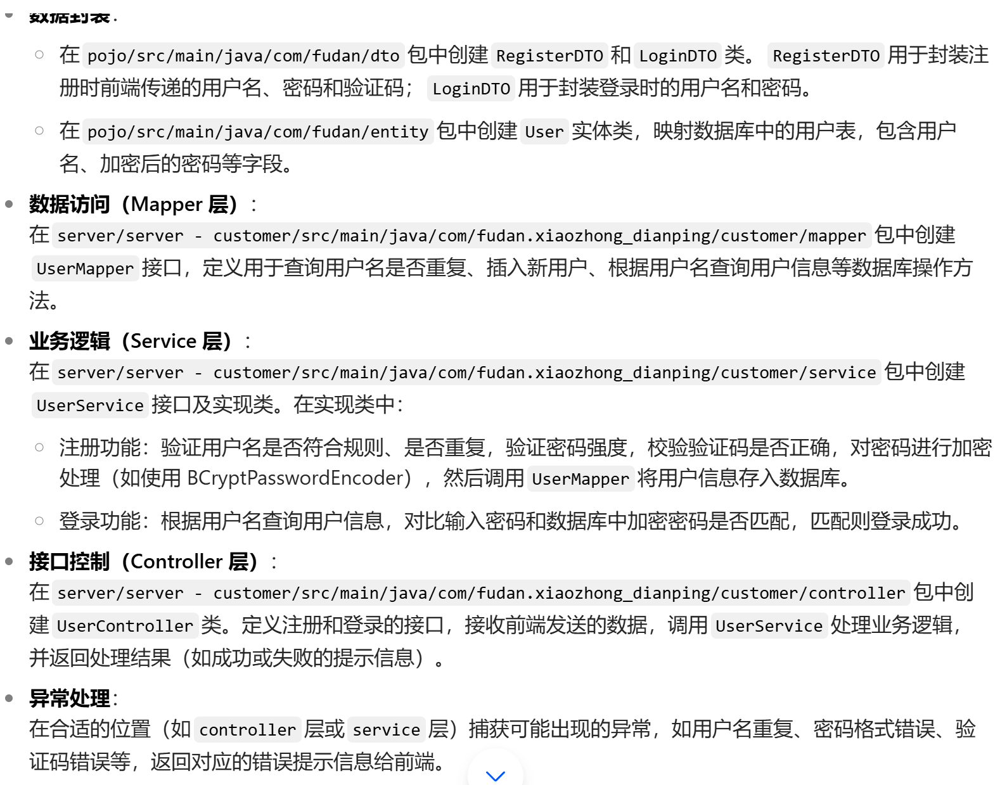

# 2025_se - 小众点评网站

## 项目描述
本项目是一个类似大众点评功能的“小众点评”网站。本学期我们将逐步实现网站的核心功能，Lab1 的重点是实现用户登录和注册功能。

## 功能目标
### Lab1: 用户登录和注册功能
1. **用户注册**：
   - 用户输入用户名、密码和验证码，创建账号。
   - 用户名要求：
     - 只允许包含字母、数字、下划线（`_`）。
     - 长度在 4～20 个字符之间。
     - 不得与其他用户重复。
   - 密码要求：
     - 长度不小于 6 位。
     - 必须包含数字和字母。
     - 在界面上显示密码强度提示（弱/中/强），标准自拟。
   - 验证码：
     - 用户注册时，页面显示一张带有随机数字的验证码图片。
     - 用户需要正确输入验证码。
     - 点击验证码图片可刷新验证码。

2. **用户登录**：
   - 用户输入用户名和密码，验证成功后跳转至首页。

3. **数据存储**：
   - 账号信息存入数据库。
   - 密码不得明文存储，需进行加密处理。

4. **前后端分离开发**：
   - 前端负责发送数据（如用户名、密码、验证码）。
   - 后端负责处理数据并返回结果（如注册成功、登录成功、错误提示等）。

5. **异常处理与错误提示**：
   - 对常见异常情况进行处理，例如：
     - 用户名已存在。
     - 密码错误。
     - 验证码错误。
   - 在界面上显示友好的错误提示信息。

## 文件结构
project/
│
├── src/ # 源代码目录
│ ├── api/ # API 接口
│ ├── auth/ # 用户认证模块
│ ├── config/ # 配置文件
│ ├── models/ # 数据库模型
│ ├── utils/ # 工具函数
│ └── main.py # 主程序入口
│
├── tests/ # 测试代码目录
│ ├── test_auth.py # 用户认证测试
│ └── test_utils.py # 工具函数测试
│
├── frontend/ # 前端代码目录
│ ├── public/ # 静态资源
│ └── src/ # 前端源代码
│
├── docs/ # 文档目录
│ └── README.md # 项目说明文档
│
├── requirements.txt # 项目依赖
└── .gitignore # Git 忽略文件

## 开发规范
1. **Commit Message 规范**：
   - `feat`: 新功能
   - `fix`: 修复 bug
   - `docs`: 文档更新
   - `style`: 代码格式调整
   - `refactor`: 代码重构
   - `test`: 测试相关
   - `chore`: 构建过程或辅助工具的变动

2. **分支管理**：
   - 从 `develop` 分支创建新分支进行开发，命名格式为 `feature/功能名称`。
   - 开发完成后，提交 Merge Request 到 `develop` 分支。

3. **代码审查**：
   - 每位同学的代码需经过至少一位其他同学的审查后才能合并。

## 安装与运行
1. 克隆仓库：
   ```bash
   git clone git@codehub.devcloud.cn-east-3.huaweicloud.com:256c0d48d98941eb893126abc5d5bb5e/2025_se.git
- 可参考文件组织：


- mapper层可以替代dao文件夹。以下是具体说明：
- 功能等价性：二者都承担数据持久化操作职责

- dao (Data Access Object)：JPA规范中数据库操作的抽象层
- mapper：MyBatis框架中SQL映射的接口定义
技术栈对应关系：

使用JPA时 → 建议保留dao目录
使用MyBatis时 → 建议使用mapper目录




- 在hotfix分支上修改readme文件


- 在 ShopMapper 中定义 findShopById 方法（通过注解或 XML）。
- 创建 ShopImage 实体类和 ShopImageMapper，并在数据库中创建 shop_image 表。
- 在 ShopImageMapper 中定义 findImagesByShopId 方法，用于根据商家 ID 查询图片。

当用户在前端分页列表中点击某个商家时，
前端会获取该商家的 ID，然后向后端发送一个请求，
请求该商家的详细信息。后端接收到这个 ID 后，
调用 findShopById 方法从数据库中查询对应的商家数据，再返回给前端，前端拿到数据后渲染详情页。


# lab3
## 后端部分 (Java Spring Boot)
### 实体类 (Entity)
- GroupBuyPackage.java: 团购套餐实体类，存储套餐基本信息，如标题、价格、描述、内容等。
- VoucherCode.java: 券码实体类，存储生成的16位随机数字券码，关联到特定订单。
- GroupBuyOrder.java: 团购订单实体类，记录用户购买记录，关联用户、套餐和券码信息。
### 控制器 (Controller)
- GroupBuyController.java: 处理团购套餐相关请求，如获取套餐列表、套餐详情等。
- OrderController.java: 处理订单相关请求，如创建订单、查询订单列表等。
- VoucherController.java: 处理券码相关请求，如获取券码详情、验证券码等。
### 服务层 (Service)
- GroupBuyService.java 和 GroupBuyServiceImpl.java: 团购套餐业务逻辑接口及实现类，处理套餐查询等功能。
- OrderService.java 和 OrderServiceImpl.java: 订单业务逻辑接口及实现类，处理订单创建、查询等功能，并更新套餐销量。
- VoucherService.java 和 VoucherServiceImpl.java: 券码业务逻辑接口及实现类，处理券码生成、查询等功能。
### 数据访问层 (Repository)
- GroupBuyPackageRepository.java: 团购套餐数据访问接口，负责套餐数据的CRUD操作。
- GroupBuyOrderRepository.java: 订单数据访问接口，负责订单数据的CRUD操作。
- VoucherCodeRepository.java: 券码数据访问接口，负责券码数据的CRUD操作。
### 数据传输对象 (DTO)
- GroupBuyPackageDTO.java: 团购套餐数据传输对象，用于前后端数据交换。
- OrderDTO.java: 订单数据传输对象，用于前后端数据交换。
- VoucherDTO.java: 券码数据传输对象，用于前后端数据交换。
### 工具类 (Utils)
- VoucherCodeGenerator.java: 券码生成工具类，生成唯一的16位随机数字券码。
- QRCodeGenerator.java: 二维码生成工具类，根据券码生成可供商户扫描验证的二维码。