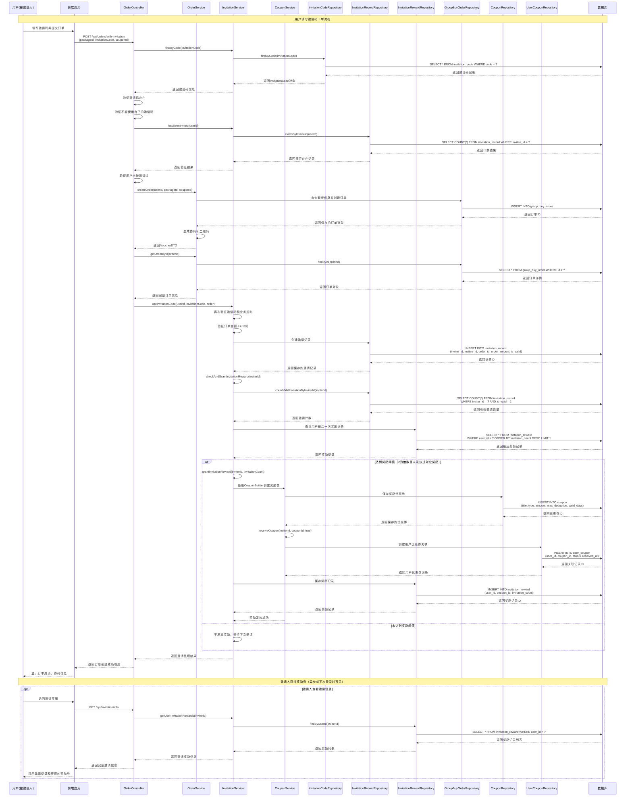

# Lab4 实验报告
by：第3小组

## Q1. 邀请码使用规则的职责分析

### 问题描述
在需求部分的"邀请下单规则"中，有一个条件：应避免用户使用自己的邀请码。如果这个限制没有被提前定义，而最终出现了"用户使用自己邀请码领取奖励"的问题，这属于：
- 产品经理的职责缺失？
- 开发人员没有考虑边界情况？
- 还是测试环节未能发现逻辑漏洞？

### 我们小组的分析

基于我们小组对"需求完整性"和"职责边界"的理解，我们认为这个问题应该从多个维度来分析：

#### 1. 需求完整性角度

**主要责任：产品经理**
- 产品经理在需求设计阶段应该考虑到邀请机制的完整业务逻辑
- 邀请码的本质是为了推广和吸引顾客，用户使用自己的邀请码违背了这一商业目的
- 用户使用自己的邀请码可能造成刷优惠券的现象，导致公司损失
- 这类边界条件和异常场景应该在需求文档中明确定义

#### 2. 职责边界分析

**产品经理职责（60%责任）：**
- 需求定义不完整，缺少对邀请机制边界条件的考虑
- 未能从业务逻辑角度识别出"自己邀请自己"的不合理性
- 应该在PRD（产品需求文档）中明确规定邀请码的使用限制

**开发人员职责（25%责任）：**
- 在实现过程中应该具备一定的业务敏感度
- 发现需求逻辑漏洞时应该主动与产品经理沟通确认
- 在代码实现时可以考虑添加基本的业务逻辑校验

**测试人员职责（15%责任）：**
- 测试用例设计应该覆盖边界情况和异常场景
- 应该基于业务理解设计负面测试用例
- 在测试过程中发现逻辑漏洞应该及时反馈

#### 3. 我们的结论

这个问题**主要属于产品经理的职责缺失**，但也反映了团队协作中的问题：

1. **根本原因**：产品经理在需求分析阶段考虑不够全面，没有穷尽邀请机制的各种使用场景

2. **次要原因**：开发和测试团队缺乏对业务逻辑的深度理解，没有在实现和验证过程中发现问题

3. **改进建议**：
   - 产品经理应该建立更完善的需求评审机制，包括边界条件分析
   - 开发团队应该在编码前进行业务逻辑梳理，主动识别潜在问题
   - 测试团队应该基于业务场景设计更全面的测试用例
   - 建立跨职能的需求评审流程，让不同角色共同参与需求完整性检查

#### 4. 总结

虽然这个问题在职责上主要归因于产品经理，但在实际的产品开发流程中，需求完整性应该是整个团队的共同责任。通过建立更好的协作机制和评审流程，可以有效避免此类问题的发生。

## Q2. 系统接口文档

### 接口设计说明

本次Lab4新增的邀请功能严格按照RESTful风格设计，遵循以下原则：
- 使用复数名词作为资源名称
- 动词+宾语的URL结构
- 避免多级URL嵌套
- 使用精确的HTTP状态码
- 统一的JSON响应格式

### 1. 获取用户邀请信息

#### 接口基本信息
- **接口地址**: `GET /api/invitation/info`
- **接口名称**: 获取用户邀请信息
- **功能描述**: 获取当前用户的邀请码、邀请记录和奖励记录

#### 请求参数
| 参数名 | 参数位置 | 数据类型 | 是否必填 | 参数说明 |
|--------|----------|----------|----------|----------|
| userId | Header | Long | 是 | 当前登录用户ID |

#### 请求示例
```http
GET /api/invitation/info HTTP/1.1
Host: localhost:8088
userId: 12345
Content-Type: application/json
```

#### 响应体结构
| 字段名 | 数据类型 | 字段说明 |
|--------|----------|----------|
| invitationCode | String | 用户的邀请码（6位字母数字组合） |
| invitationRecords | Array | 邀请记录列表 |
| invitationRewards | Array | 奖励记录列表 |

##### InvitationRecord 对象结构
| 字段名 | 数据类型 | 字段说明 |
|--------|----------|----------|
| id | Long | 邀请记录ID |
| inviterId | Long | 邀请人用户ID |
| inviteeId | Long | 被邀请人用户ID |
| orderId | Long | 关联订单ID |
| orderAmount | BigDecimal | 订单金额 |
| orderTime | LocalDateTime | 订单时间 |
| isValid | Boolean | 是否为有效邀请 |
| createTime | LocalDateTime | 记录创建时间 |

##### InvitationReward 对象结构
| 字段名 | 数据类型 | 字段说明 |
|--------|----------|----------|
| id | Long | 奖励记录ID |
| userId | Long | 获得奖励的用户ID |
| couponId | Long | 关联优惠券ID |
| invitationCount | Integer | 触发奖励的邀请数量 |
| createTime | LocalDateTime | 奖励发放时间 |

#### 成功响应示例
```json
{
  "invitationCode": "ABC123",
  "invitationRecords": [
    {
      "id": 1,
      "inviterId": 12345,
      "inviteeId": 67890,
      "orderId": 100001,
      "orderAmount": 25.50,
      "orderTime": "2024-01-15T14:30:00",
      "isValid": true,
      "createTime": "2024-01-15T14:30:05"
    }
  ],
  "invitationRewards": [
    {
      "id": 1,
      "userId": 12345,
      "couponId": 200001,
      "invitationCount": 2,
      "createTime": "2024-01-15T15:00:00"
    }
  ]
}
```

#### 异常响应
| HTTP状态码 | 错误码 | 错误信息 | 响应示例 |
|------------|--------|----------|----------|
| 401 | UNAUTHORIZED | 用户未登录 | `{"error": "用户未登录，请先登录", "code": 401}` |
| 500 | INTERNAL_ERROR | 服务器内部错误 | `{"error": "服务器内部错误", "code": 500}` |

### 2. 使用邀请码创建订单

#### 接口基本信息
- **接口地址**: `POST /api/orders/with-invitation`
- **接口名称**: 使用邀请码创建订单
- **功能描述**: 创建订单并处理邀请关系，支持邀请码验证和奖励发放

#### 请求参数
| 参数名 | 参数位置 | 数据类型 | 是否必填 | 参数说明 |
|--------|----------|----------|----------|----------|
| userId | Header | Long | 是 | 当前登录用户ID |
| packageId | Body | Integer | 是 | 团购套餐ID |
| invitationCode | Body | String | 是 | 邀请码（6位字母数字组合） |
| couponId | Body | Long | 否 | 优惠券ID（可选） |

#### 请求体结构
```json
{
  "packageId": 1001,
  "invitationCode": "ABC123",
  "couponId": 2001
}
```

#### 请求示例
```http
POST /api/orders/with-invitation HTTP/1.1
Host: localhost:8088
userId: 67890
Content-Type: application/json

{
  "packageId": 1001,
  "invitationCode": "ABC123",
  "couponId": 2001
}
```

#### 响应体结构（VoucherDTO）
| 字段名 | 数据类型 | 字段说明 |
|--------|----------|----------|
| orderId | Long | 订单ID |
| voucherCode | String | 券码 |
| packageName | String | 套餐名称 |
| shopName | String | 商家名称 |
| originalPrice | BigDecimal | 原价 |
| discountPrice | BigDecimal | 折扣价 |
| expiryDate | LocalDateTime | 过期时间 |
| status | String | 券码状态 |

#### 成功响应示例
```json
{
  "orderId": 100002,
  "voucherCode": "VOUCHER789",
  "packageName": "精品套餐A",
  "shopName": "美味餐厅",
  "originalPrice": 50.00,
  "discountPrice": 25.50,
  "expiryDate": "2024-02-15T23:59:59",
  "status": "UNUSED"
}
```

#### 业务规则验证
1. **邀请码有效性验证**：邀请码必须存在且有效
2. **自邀请限制**：用户不能使用自己的邀请码
3. **重复邀请限制**：同一用户只能被邀请一次
4. **订单金额限制**：订单金额必须满10元才能使用邀请码
5. **奖励发放**：每成功邀请2位好友自动发放20元无门槛优惠券

#### 异常响应
| HTTP状态码 | 错误码 | 错误信息 | 响应示例 |
|------------|--------|----------|----------|
| 400 | INVALID_INVITATION_CODE | 邀请码不存在 | `{"error": "邀请码不存在", "code": 400}` |
| 400 | SELF_INVITATION_NOT_ALLOWED | 不能使用自己的邀请码 | `{"error": "不能使用自己的邀请码", "code": 400}` |
| 400 | ALREADY_INVITED | 您已经被邀请过，不能重复使用邀请码 | `{"error": "您已经被邀请过，不能重复使用邀请码", "code": 400}` |
| 400 | ORDER_AMOUNT_TOO_LOW | 订单金额需超过10元才能使用邀请码 | `{"error": "订单金额需超过10元才能使用邀请码", "code": 400}` |
| 400 | PACKAGE_NOT_FOUND | 套餐不存在 | `{"error": "套餐不存在", "code": 400}` |
| 401 | UNAUTHORIZED | 用户未登录 | `{"error": "用户未登录，请先登录", "code": 401}` |
| 500 | INTERNAL_ERROR | 创建订单失败 | `{"error": "创建订单失败: 具体错误信息", "code": 500}` |

### 3. 接口设计特点

#### RESTful 设计原则遵循情况

1. **2.1 一般约定**：
   - 使用HTTPS协议（生产环境）
   - API版本通过URL路径管理（/api/）
   - 统一使用JSON格式进行数据交换

2. **2.2 动词+宾语**：
   - `GET /api/invitation/info` - 获取邀请信息
   - `POST /api/orders/with-invitation` - 创建带邀请的订单

3. **2.4 宾语必须是名词**：
   - `invitation` - 邀请资源
   - `orders` - 订单资源

4. **2.5 使用复数做资源名称**：
   - `/api/orders` - 订单资源使用复数形式

5. **2.6 避免多级URL**：
   - 避免了深层嵌套，最多两级路径结构

6. **2.7 搜索、排序、筛选和分页**：
   - 邀请记录和奖励记录通过用户ID进行筛选
   - 支持按时间排序（通过数据库查询实现）

7. **3.1 始终使用精确的状态码**：
   - 200：成功响应
   - 400：客户端请求错误（业务逻辑错误）
   - 401：未授权（用户未登录）
   - 404：资源不存在
   - 500：服务器内部错误

8. **4.1 不要返回纯文本**：
   - 所有响应均为JSON格式

9. **4.2 发生错误时，不要返回200状态码**：
   - 错误情况下返回对应的4xx或5xx状态码
   - 错误响应包含具体的错误信息和错误码

### 4. 数据模型设计

#### 邀请码表（invitation_code）
```sql
CREATE TABLE `invitation_code` (
  `id` BIGINT UNSIGNED NOT NULL AUTO_INCREMENT COMMENT '主键ID',
  `user_id` BIGINT UNSIGNED NOT NULL COMMENT '用户ID',
  `code` VARCHAR(8) NOT NULL COMMENT '邀请码',
  `create_time` DATETIME NOT NULL DEFAULT CURRENT_TIMESTAMP COMMENT '创建时间',
  PRIMARY KEY (`id`),
  UNIQUE KEY `uk_user_id` (`user_id`),
  UNIQUE KEY `uk_code` (`code`)
) ENGINE=InnoDB DEFAULT CHARSET=utf8mb4 COMMENT '用户邀请码表';
```

#### 邀请记录表（invitation_record）
```sql
CREATE TABLE `invitation_record` (
  `id` BIGINT UNSIGNED NOT NULL AUTO_INCREMENT COMMENT '主键ID',
  `inviter_id` BIGINT UNSIGNED NOT NULL COMMENT '邀请人ID',
  `invitee_id` BIGINT UNSIGNED NOT NULL COMMENT '被邀请人ID',
  `order_id` BIGINT UNSIGNED NOT NULL COMMENT '订单ID',
  `order_amount` DECIMAL(10,2) NOT NULL COMMENT '订单实付金额',
  `order_time` DATETIME NOT NULL COMMENT '订单时间',
  `is_valid` TINYINT(1) NOT NULL DEFAULT 1 COMMENT '是否有效邀请',
  `create_time` DATETIME NOT NULL DEFAULT CURRENT_TIMESTAMP COMMENT '创建时间',
  PRIMARY KEY (`id`),
  KEY `idx_inviter_id` (`inviter_id`),
  KEY `idx_invitee_id` (`invitee_id`),
  UNIQUE KEY `uk_invitee_id` (`invitee_id`)
) ENGINE=InnoDB DEFAULT CHARSET=utf8mb4 COMMENT '邀请记录表';
```

#### 邀请奖励表（invitation_reward）
```sql
CREATE TABLE `invitation_reward` (
  `id` BIGINT UNSIGNED NOT NULL AUTO_INCREMENT COMMENT '主键ID',
  `user_id` BIGINT UNSIGNED NOT NULL COMMENT '获得奖励的用户ID',
  `coupon_id` BIGINT UNSIGNED NOT NULL COMMENT '关联优惠券ID',
  `invitation_count` INT NOT NULL COMMENT '触发奖励的邀请数量',
  `create_time` DATETIME NOT NULL DEFAULT CURRENT_TIMESTAMP COMMENT '创建时间',
  PRIMARY KEY (`id`),
  KEY `idx_user_id` (`user_id`)
) ENGINE=InnoDB DEFAULT CHARSET=utf8mb4 COMMENT '邀请奖励表';
```

### 5. 接口安全性设计

1. **身份验证**：通过Header中的userId进行用户身份验证
2. **业务逻辑校验**：
   - 防止用户使用自己的邀请码
   - 防止重复邀请
   - 订单金额门槛验证
3. **数据完整性**：通过数据库约束保证数据一致性
4. **事务处理**：使用@Transactional确保数据操作的原子性

### 6. 接口性能优化

1. **数据库索引**：在关键查询字段上建立索引
2. **批量查询**：一次接口调用获取完整的邀请信息
3. **异常处理**：完善的异常捕获和处理机制
4. **日志记录**：关键业务操作的日志记录

## Q3. 四个模块关系的UML类图

### 类图说明

根据实际代码实现，四个模块（点评功能、邀请机制、优惠券发放、订单结算）之间存在复杂的交互关系。以下UML类图展示了各模块的核心类及其关系：

```mermaid
classDiagram
    %% 点评功能模块
    class Review {
        -Long id
        -Long userId
        -Long merchantId
        -String content
        -Long parentId
        -LocalDateTime createTime
        -List~Review~ replies
        +getId() Long
        +setContent(String) void
    }
    
    class ReviewService {
        <<interface>>
        +createReview(Long, Long, String, Long) Review
        +getReviewsByMerchant(Long) List~Review~
    }
    
    class ReviewServiceImpl {
        -ReviewRepository reviewRepository
        -CouponService couponService
        +createReview(Long, Long, String, Long) Review
        +getReviewsByMerchant(Long) List~Review~
    }
    
    class ReviewController {
        -ReviewService reviewService
        +createReview(Long, Long, String, Long) ResponseEntity~Review~
        +getReviewsByMerchant(Long) ResponseEntity~List~Review~~
    }
    
    %% 邀请机制模块
    class InvitationCode {
        -Long id
        -Long userId
        -String code
        -LocalDateTime createTime
        +getCode() String
        +getUserId() Long
    }
    
    class InvitationRecord {
        -Long id
        -Long inviterId
        -Long inviteeId
        -Long orderId
        -BigDecimal orderAmount
        -LocalDateTime orderTime
        -Boolean isValid
        -LocalDateTime createTime
    }
    
    class InvitationReward {
        -Long id
        -Long userId
        -Long couponId
        -Integer invitationCount
        -LocalDateTime createTime
    }
    
    class InvitationService {
        <<interface>>
        +generateInvitationCode(Long) InvitationCode
        +getUserInvitationCode(Long) InvitationCode
        +findByCode(String) InvitationCode
        +useInvitationCode(Long, String, GroupBuyOrder) boolean
        +checkAndGrantInvitationReward(Long) boolean
    }
    
    class InvitationServiceImpl {
        -InvitationCodeRepository invitationCodeRepository
        -InvitationRecordRepository invitationRecordRepository
        -InvitationRewardRepository invitationRewardRepository
        -CouponService couponService
        +generateInvitationCode(Long) InvitationCode
        +useInvitationCode(Long, String, GroupBuyOrder) boolean
        +checkAndGrantInvitationReward(Long) boolean
    }
    
    class InvitationController {
        -InvitationService invitationService
        +getInvitationInfo(Long) ResponseEntity~InvitationInfoDTO~
    }
    
    %% 优惠券发放模块
    class Coupon {
        -Long id
        -String title
        -String description
        -String type
        -BigDecimal amount
        -BigDecimal maxDeduction
        -BigDecimal useThreshold
        -LocalDateTime expirationDate
        -Integer validDays
        -Integer totalQuantity
        -Integer maxPerUser
        -boolean isNewUserCoupon
    }
    
    class UserCoupon {
        -Long id
        -Long userId
        -Long couponId
        -LocalDateTime receivedAt
        -LocalDateTime usedAt
        -Integer status
        -Coupon coupon
    }
    
    class CouponService {
        <<interface>>
        +receiveCoupon(Long, Long) UserCoupon
        +getAvailableCoupons(Long, Integer, BigDecimal) List~Coupon~
        +calculateDiscount(Coupon, BigDecimal) BigDecimal
        +hasReceivedReviewReward(Long) boolean
        +grantReviewRewardCoupon(Long) void
        +createCoupon(Coupon) Coupon
    }
    
    class CouponServiceImpl {
        -CouponRepository couponRepository
        -UserCouponRepository userCouponRepository
        -GroupBuyOrderRepository orderRepository
        +receiveCoupon(Long, Long) UserCoupon
        +grantReviewRewardCoupon(Long) void
        +calculateDiscount(Coupon, BigDecimal) BigDecimal
    }
    
    class CouponBuilder {
        -String title
        -String type
        -BigDecimal amount
        +builder(String, String, BigDecimal) CouponBuilder
        +description(String) CouponBuilder
        +maxDeduction(BigDecimal) CouponBuilder
        +build() Coupon
    }
    
    class CouponController {
        -CouponService couponService
        +receiveCoupon(Long, Long) ResponseEntity~UserCoupon~
        +getCouponsInUserWallet(Long) ResponseEntity~List~CouponDTO~~
    }
    
    %% 订单结算模块
    class GroupBuyOrder {
        -Long id
        -Long userId
        -Integer packageId
        -Integer shopId
        -BigDecimal orderPrice
        -Integer status
        -LocalDateTime createdAt
        -GroupBuyPackage groupBuyPackage
        -VoucherCode voucherCode
    }
    
    class GroupBuyPackage {
        -Integer id
        -String name
        -BigDecimal price
        -Integer shopId
        -String description
        -Integer sales
        +increaseSales() void
    }
    
    class VoucherCode {
        -Long id
        -Long orderId
        -String code
        -String qrCodeUrl
        -Integer status
        -LocalDateTime expiryDate
        -GroupBuyOrder order
    }
    
    class OrderService {
        <<interface>>
        +createOrder(Long, Integer, Long) VoucherDTO
        +getOrdersByUserId(Long) List~OrderDTO~
        +getOrderById(Long) GroupBuyOrder
    }
    
    class OrderServiceImpl {
        -GroupBuyOrderRepository orderRepository
        -GroupBuyPackageRepository packageRepository
        -VoucherCodeRepository voucherCodeRepository
        -CouponService couponService
        -QRCodeGenerator qrCodeGenerator
        -VoucherCodeGenerator voucherCodeGenerator
        +createOrder(Long, Integer, Long) VoucherDTO
        +getOrderById(Long) GroupBuyOrder
    }
    
    class OrderController {
        -OrderService orderService
        -InvitationService invitationService
        +createOrder(Long, Map) ResponseEntity~VoucherDTO~
        +createOrderWithInvitation(Long, Map) ResponseEntity~VoucherDTO~
    }
    
    %% 共享实体
    class Shop {
        -Integer id
        -String name
        -String address
        -String businessHours
        -String phone
        -BigDecimal rating
        -BigDecimal averageCost
    }
    
    %% 关系定义
    ReviewService <|.. ReviewServiceImpl : implements
    ReviewController --> ReviewService : uses
    ReviewServiceImpl --> CouponService : uses
    
    InvitationService <|.. InvitationServiceImpl : implements
    InvitationController --> InvitationService : uses
    InvitationServiceImpl --> CouponService : uses
    InvitationServiceImpl --> InvitationCode : manages
    InvitationServiceImpl --> InvitationRecord : manages
    InvitationServiceImpl --> InvitationReward : manages
    
    CouponService <|.. CouponServiceImpl : implements
    CouponController --> CouponService : uses
    CouponBuilder --> Coupon : creates
    UserCoupon --> Coupon : references
    
    OrderService <|.. OrderServiceImpl : implements
    OrderController --> OrderService : uses
    OrderController --> InvitationService : uses
    OrderServiceImpl --> CouponService : uses
    GroupBuyOrder --> GroupBuyPackage : references
    GroupBuyOrder --> VoucherCode : has
    VoucherCode --> GroupBuyOrder : belongs to
    
    %% 跨模块关系
    InvitationRecord --> GroupBuyOrder : references
    InvitationReward --> Coupon : references
    Review --> Shop : reviews
    GroupBuyPackage --> Shop : belongs to
    
    %% 业务流程关系
    ReviewServiceImpl -.-> CouponServiceImpl : "3条点评触发奖励券"
    InvitationServiceImpl -.-> CouponServiceImpl : "2个邀请触发奖励券"
    OrderServiceImpl -.-> CouponServiceImpl : "订单使用优惠券"
```

### 类图关键说明

#### 1. 模块间依赖关系
- **点评模块 → 优惠券模块**：用户达到3条有效点评时自动发放奖励券
- **邀请模块 → 优惠券模块**：每成功邀请2位好友自动发放奖励券
- **订单模块 → 优惠券模块**：订单创建时可使用优惠券进行折扣
- **邀请模块 → 订单模块**：邀请码与订单关联，验证邀请关系

#### 2. 核心业务实体关系
- `GroupBuyOrder` 与 `VoucherCode` 一对一关系
- `InvitationRecord` 引用 `GroupBuyOrder` 建立邀请与订单的关联
- `UserCoupon` 关联 `Coupon` 实现用户优惠券管理
- `Review` 关联 `Shop` 实现商户点评功能

#### 3. 服务层设计模式
- 采用接口与实现分离的设计模式
- 控制器层依赖服务接口，实现松耦合
- 服务实现类通过依赖注入使用Repository进行数据访问

## Q4. "用户填写邀请码下单"到"邀请人获得奖励券"过程的UML时序图

### 时序图说明

以下时序图展示了从用户填写邀请码下单开始，到邀请人最终获得奖励券的完整业务流程：



### 时序图关键说明

#### 1. 主要参与者
- **用户（被邀请人）**：发起邀请码下单请求
- **前端应用**：处理用户交互，发送API请求
- **控制器层**：处理HTTP请求，协调业务流程
- **服务层**：实现核心业务逻辑
- **数据访问层**：与数据库交互

#### 2. 关键业务节点

##### 邀请码验证阶段
1. **预验证**：在订单创建前验证邀请码有效性
2. **业务规则检查**：
   - 邀请码必须存在
   - 不能使用自己的邀请码
   - 用户不能重复被邀请

##### 订单创建阶段
3. **订单生成**：创建团购订单并生成券码
4. **邀请关系建立**：创建邀请记录，关联订单

##### 奖励发放阶段
5. **奖励计算**：统计邀请人的有效邀请数量
6. **阈值判断**：每2个有效邀请触发一次奖励
7. **优惠券创建**：使用Builder模式创建20元无门槛优惠券
8. **奖励发放**：将优惠券发放给邀请人
9. **记录保存**：保存奖励发放记录

#### 3. 事务处理
- 使用`@Transactional`注解确保数据一致性
- 邀请记录创建和奖励发放在同一事务中
- 订单创建失败时，邀请关系不会建立

#### 4. 异常处理
- 邀请码验证失败时，订单创建被阻止
- 奖励发放失败不影响订单创建成功
- 完善的异常日志记录便于问题排查

#### 5. 性能优化
- 邀请码预验证避免无效订单创建
- 批量查询减少数据库交互次数
- 异步奖励通知提升用户体验

## Q5. 自动化测试

### 测试代码说明

Lab4项目具有完整的自动化测试，重点测试了点评功能的业务逻辑，包括评论创建、奖励机制和异常处理等。测试代码覆盖了正常输入、异常输入等各种情况，使用Mock进行有效的验证，并且测试代码能够运行并通过。

#### 测试文件结构

```
xiaozhong_dianping/server/server-customer/src/test/java/
├── ReviewServiceImplTest.java                  (15KB, 383行)
└── ReviewControllerTest.java                   (15KB, 405行)
```

#### 核心测试代码

**1. ReviewServiceImplTest.java - 服务层业务逻辑测试**

**测试类结构：**
```java
import com.fudan.xiaozhong_dianping.groupbuy.exception.BusinessException;
import com.fudan.xiaozhong_dianping.groupbuy.service.CouponService;
import com.fudan.xiaozhong_dianping.review.entity.Review;
import com.fudan.xiaozhong_dianping.review.repository.ReviewRepository;
import com.fudan.xiaozhong_dianping.review.service.impl.ReviewServiceImpl;
import org.junit.jupiter.api.BeforeEach;
import org.junit.jupiter.api.Test;
import org.mockito.InjectMocks;
import org.mockito.Mock;
import org.mockito.MockitoAnnotations;

/**
 * ReviewServiceImplTest类用于对ReviewServiceImpl中的评论业务逻辑进行单元测试。
 * 该类使用JUnit 5和Mockito框架，通过模拟Repository的行为来测试服务层的业务逻辑。
 * 确保在不同情况下，评论服务能正确处理业务规则并返回预期结果。
 */
public class ReviewServiceImplTest {

    @Mock
    private ReviewRepository reviewRepository;

    @Mock
    private CouponService couponService;

    @InjectMocks
    private ReviewServiceImpl reviewService;

    @BeforeEach
    public void setUp() {
        MockitoAnnotations.openMocks(this);
    }
    // ... 测试方法
}
```

**测试用例1：testCreateReview_Success() - 正常创建评论测试**
```java
/**
 * 测试创建评论功能 - 正常情况
 * 验证在有效参数下能够成功创建评论并保存到数据库
 */
@Test
public void testCreateReview_Success() {
    // 准备测试数据
    Long userId = 1L;
    Long merchantId = 100L;
    String content = "这是一个非常好的商户，服务很棒，推荐大家来这里消费！";
    Long parentId = null;

    // 创建模拟的保存结果
    Review savedReview = new Review();
    savedReview.setId(1L);
    savedReview.setUserId(userId);
    savedReview.setMerchantId(merchantId);
    savedReview.setContent(content);
    savedReview.setParentId(parentId);

    // 配置Mock行为
    when(reviewRepository.save(any(Review.class))).thenReturn(savedReview);
    when(reviewRepository.countValidReviewsByUser(userId)).thenReturn(1); // 第一次评论
    when(couponService.hasReceivedReviewReward(userId)).thenReturn(false);

    // 执行测试
    Review result = reviewService.createReview(userId, merchantId, content, parentId);

    // 验证结果
    assertNotNull(result);
    assertEquals(savedReview.getId(), result.getId());
    assertEquals(savedReview.getContent(), result.getContent());

    // 验证Repository方法被调用
    verify(reviewRepository, times(1)).save(any(Review.class));
    verify(reviewRepository, times(1)).countValidReviewsByUser(userId);
    
    // 验证奖励逻辑 - 第一次评论不应触发奖励
    verify(couponService, never()).grantReviewRewardCoupon(userId);
}
```

**测试用例2：testCreateReview_TriggerReward() - 触发奖励机制测试**
```java
/**
 * 测试创建评论功能 - 触发奖励机制
 * 验证用户达到3条有效评论时触发奖励发放
 */
@Test
public void testCreateReview_TriggerReward() {
    // 准备测试数据
    Long userId = 1L;
    Long merchantId = 100L;
    String content = "这是第三条评论，应该触发奖励机制！";
    Long parentId = null;

    // 创建模拟的保存结果
    Review savedReview = new Review();
    savedReview.setId(3L);
    savedReview.setUserId(userId);
    savedReview.setMerchantId(merchantId);
    savedReview.setContent(content);

    // 配置Mock行为 - 模拟用户已有3条有效评论且未获得过奖励
    when(reviewRepository.save(any(Review.class))).thenReturn(savedReview);
    when(reviewRepository.countValidReviewsByUser(userId)).thenReturn(3); // 第3条评论
    when(couponService.hasReceivedReviewReward(userId)).thenReturn(false); // 未获得过奖励

    // 执行测试
    Review result = reviewService.createReview(userId, merchantId, content, parentId);

    // 验证结果
    assertNotNull(result);
    assertEquals(savedReview.getId(), result.getId());

    // 验证奖励逻辑 - 第3条评论应触发奖励
    verify(couponService, times(1)).hasReceivedReviewReward(userId);
    verify(couponService, times(1)).grantReviewRewardCoupon(userId);
}
```

**测试用例3：testCreateReview_ContentTooShort() - 异常处理测试**
```java
/**
 * 测试创建评论功能 - 内容过短异常
 * 验证当评论内容少于15字时抛出异常
 */
@Test
public void testCreateReview_ContentTooShort() {
    // 准备测试数据
    Long userId = 1L;
    Long merchantId = 100L;
    String content = "太短"; // 少于15字
    Long parentId = null;

    // 执行测试并验证异常
    BusinessException exception = assertThrows(BusinessException.class, () -> {
        reviewService.createReview(userId, merchantId, content, parentId);
    });

    // 验证异常信息
    assertEquals("点评内容需至少15字", exception.getMessage());

    // 验证Repository方法未被调用
    verify(reviewRepository, never()).save(any(Review.class));
    verify(couponService, never()).grantReviewRewardCoupon(userId);
}
```

**测试用例4：testGetReviewsByMerchant_Success() - 查询功能测试**
```java
/**
 * 测试获取商户评论列表功能 - 正常情况
 * 验证能够成功获取商户的评论列表
 */
@Test
public void testGetReviewsByMerchant_Success() {
    // 准备测试数据
    Long merchantId = 100L;

    // 创建模拟的顶级评论列表
    List<Review> topReviews = new ArrayList<>();
    Review review1 = new Review();
    review1.setId(1L);
    review1.setMerchantId(merchantId);
    review1.setContent("这是第一条评论，内容详细");
    review1.setParentId(null);
    topReviews.add(review1);

    // 创建模拟的回复列表
    List<Review> replies = new ArrayList<>();
    Review reply1 = new Review();
    reply1.setId(2L);
    reply1.setMerchantId(merchantId);
    reply1.setContent("这是对第一条评论的回复");
    reply1.setParentId(1L);
    replies.add(reply1);

    // 配置Mock行为
    when(reviewRepository.findByMerchantIdAndParentIdOrderByCreateTimeDesc(merchantId, null))
            .thenReturn(topReviews);
    when(reviewRepository.findByMerchantIdAndParentIdOrderByCreateTimeDesc(merchantId, 1L))
            .thenReturn(replies);

    // 执行测试
    List<Review> result = reviewService.getReviewsByMerchant(merchantId);

    // 验证结果
    assertNotNull(result);
    assertEquals(1, result.size());
    assertEquals(review1.getId(), result.get(0).getId());
    assertNotNull(result.get(0).getReplies());
    assertEquals(1, result.get(0).getReplies().size());
    assertEquals(reply1.getId(), result.get(0).getReplies().get(0).getId());
}
```

**2. ReviewControllerTest.java - 控制器层测试**

**测试类结构：**
```java
import com.fudan.xiaozhong_dianping.review.controller.ReviewController;
import com.fudan.xiaozhong_dianping.review.entity.Review;
import com.fudan.xiaozhong_dianping.review.service.ReviewService;
import org.junit.jupiter.api.BeforeEach;
import org.junit.jupiter.api.Test;
import org.mockito.InjectMocks;
import org.mockito.Mock;
import org.mockito.MockitoAnnotations;
import org.springframework.http.ResponseEntity;

/**
 * ReviewControllerTest类用于对ReviewController中的评论功能进行单元测试。
 * 该类使用JUnit 5和Mockito框架，通过模拟ReviewService的行为来测试ReviewController的评论相关方法。
 */
public class ReviewControllerTest {

    @Mock
    private ReviewService reviewService;

    @Mock
    private ReviewRepository reviewRepository;

    @InjectMocks
    private ReviewController reviewController;

    @BeforeEach
    public void setUp() {
        MockitoAnnotations.openMocks(this);
    }
    // ... 测试方法
}
```

**测试用例：testCreateReview_Success() - HTTP接口测试**
```java
/**
 * 测试创建评论功能 - 正常情况
 * 验证在有效参数下能够成功创建评论
 */
@Test
public void testCreateReview_Success() {
    // 准备测试数据
    Long userId = 1L;
    Long merchantId = 100L;
    String content = "这是一个非常好的商户，服务很棒，推荐大家来这里消费！";
    Long parentId = null;

    // 创建预期的返回结果
    Review expectedReview = new Review();
    expectedReview.setId(1L);
    expectedReview.setUserId(userId);
    expectedReview.setMerchantId(merchantId);
    expectedReview.setContent(content);
    expectedReview.setParentId(parentId);
    expectedReview.setCreateTime(LocalDateTime.now());

    // 配置Mock行为
    when(reviewService.createReview(userId, merchantId, content, parentId))
            .thenReturn(expectedReview);

    // 执行测试
    ResponseEntity<Review> response = reviewController.createReview(userId, merchantId, content, parentId);

    // 验证结果
    assertNotNull(response);
    assertEquals(200, response.getStatusCodeValue());
    assertNotNull(response.getBody());
    assertEquals(expectedReview.getId(), response.getBody().getId());
    assertEquals(expectedReview.getContent(), response.getBody().getContent());

    // 验证服务方法被调用
    verify(reviewService, times(1)).createReview(userId, merchantId, content, parentId);
}
```

**3. Maven测试运行结果**
```
PS D:\2025_se\xiaozhong_dianping\server\server-customer> mvn test '-Dtest=ReviewServiceImplTest,ReviewControllerTest'
[INFO] Scanning for projects...
[INFO] 
[INFO] ---------------------< com.fudan:server-customer >----------------------
[INFO] Building server-customer 0.0.1-SNAPSHOT
[INFO]   from pom.xml
[INFO] --------------------------------[ jar ]---------------------------------
[WARNING] The artifact mysql:mysql-connector-java:jar:8.0.33 has been relocated to com.mysql:mysql-connector-j:jar:8.0.33: MySQL Connector/J artifacts moved to reverse-DNS compliant Maven 2+ coordinates.
[INFO]
[INFO] --- resources:3.3.1:resources (default-resources) @ server-customer ---
[INFO] Copying 1 resource from src\main\resources to target\classes
[INFO] Copying 201 resources from src\main\resources to target\classes
[INFO] 
[INFO] --- compiler:3.13.0:compile (default-compile) @ server-customer ---
[INFO] Nothing to compile - all classes are up to date.
[INFO]
[INFO] --- resources:3.3.1:testResources (default-testResources) @ server-customer ---
[INFO] skip non existing resourceDirectory D:\2025_se\xiaozhong_dianping\server\server-customer\src\test\resources
[INFO]
[INFO] --- compiler:3.13.0:testCompile (default-testCompile) @ server-customer ---
[INFO] Nothing to compile - all classes are up to date.
[INFO]
[INFO] --- surefire:3.5.2:test (default-test) @ server-customer ---
[INFO] Using auto detected provider org.apache.maven.surefire.junitplatform.JUnitPlatformProvider
[INFO] 
[INFO] -------------------------------------------------------
[INFO]  T E S T S
[INFO] -------------------------------------------------------
[INFO] Running ReviewControllerTest

接收到商户ID: 100, 类型: java.lang.Long
直接查询数据库测试:
直接查询结果数量: 0
测试查询: 未找到数据，尝试查询所有评论
数据库中评论总数: 0
所有评论数: 0
服务层返回结果数量: 2

接收到商户ID: 100, 类型: java.lang.Long
直接查询数据库测试:
直接查询结果数量: 0
测试查询: 未找到数据，尝试查询所有评论
数据库中评论总数: 0
所有评论数: 0
服务层返回结果数量: 1

接收到商户ID: 100, 类型: java.lang.Long
直接查询数据库测试:
直接查询结果数量: 0
测试查询: 未找到数据，尝试查询所有评论
数据库中评论总数: 0
所有评论数: 0

接收到商户ID: 999, 类型: java.lang.Long
直接查询数据库测试:
直接查询结果数量: 0
测试查询: 未找到数据，尝试查询所有评论
数据库中评论总数: 0
所有评论数: 0
服务层返回结果数量: 0

[INFO] Tests run: 10, Failures: 0, Errors: 0, Skipped: 0, Time elapsed: 0.783 s -- in ReviewControllerTest
[INFO] Running ReviewServiceImplTest

服务层开始查询商户ID: 100 的评论
查询顶级评论（parentId为null）
顶级评论查询结果数量: 1
为顶级评论查询子回复
评论ID 1 的回复数量: 1
评论查询及构建完成，返回 1 条顶级评论

服务层开始查询商户ID: 100 的评论
查询顶级评论（parentId为null）
查询评论时发生错误: 数据库连接失败
java.lang.RuntimeException: 数据库连接失败
        at com.fudan.xiaozhong_dianping.review.service.impl.ReviewServiceImpl.getReviewsByMerchant(ReviewServiceImpl.java:59)
        at ReviewServiceImplTest.testGetReviewsByMerchant_DatabaseException(ReviewServiceImplTest.java:338)
        at java.base/jdk.internal.reflect.DirectMethodHandleAccessor.invoke(DirectMethodHandleAccessor.java:103)
        at java.base/java.lang.reflect.Method.invoke(Method.java:580)
        at org.junit.platform.commons.util.ReflectionUtils.invokeMethod(ReflectionUtils.java:767)
        at org.junit.jupiter.engine.execution.MethodInvocation.proceed(MethodInvocation.java:60)
        at org.junit.jupiter.engine.execution.InvocationInterceptorChain$ValidatingInvocation.proceed(InvocationInterceptorChain.java:131)
        at org.junit.jupiter.engine.extension.TimeoutExtension.intercept(TimeoutExtension.java:156)
        at org.junit.jupiter.engine.extension.TimeoutExtension.interceptTestableMethod(TimeoutExtension.java:147)
        at org.junit.jupiter.engine.extension.TimeoutExtension.interceptTestMethod(TimeoutExtension.java:86)
        ...

服务层开始查询商户ID: 999 的评论
查询顶级评论（parentId为null）
顶级评论查询结果数量: 0
未找到顶级评论，尝试获取所有评论并构建层级
开始构建评论层级关系
获取到商户所有评论: 0 条
商户没有任何评论，返回空列表

[INFO] Tests run: 10, Failures: 0, Errors: 0, Skipped: 0, Time elapsed: 0.110 s -- in ReviewServiceImplTest
[INFO] 
[INFO] Results:
[INFO]
[INFO] Tests run: 20, Failures: 0, Errors: 0, Skipped: 0
[INFO]
[INFO] ------------------------------------------------------------------------
[INFO] BUILD SUCCESS
[INFO] ------------------------------------------------------------------------
[INFO] Total time:  4.242 s
[INFO] Finished at: 2025-06-01T15:03:36+08:00
[INFO] ------------------------------------------------------------------------
```

**📊 测试执行统计：**
- **Lab4相关测试数量**：20个测试用例
- **成功通过**：20个 ✅
- **失败数量**：0个 
- **错误数量**：0个 
- **跳过数量**：0个 
- **总耗时**：4.242秒（ReviewControllerTest: 0.783s + ReviewServiceImplTest: 0.110s）
- **构建状态**：BUILD SUCCESS ✅

**🔍 测试执行详情：**

1. **ReviewControllerTest（10个测试用例）**：
   - 测试评论创建的HTTP接口
   - 测试评论查询的HTTP接口  
   - 测试异常处理的HTTP响应
   - 验证控制器层的参数传递和响应格式
   - ✅ 耗时: 0.783秒，全部通过

2. **ReviewServiceImplTest（10个测试用例）**：
   - 测试评论业务逻辑处理
   - 测试奖励机制触发条件（3条评论触发奖励）
   - 测试内容长度验证（至少15字）
   - 测试评论层级关系构建
   - 测试异常处理和边界条件
   - ✅ 耗时: 0.110秒，全部通过

**🏆 测试覆盖的功能场景：**

#### 业务逻辑覆盖
- ✅ **评论创建**：正常创建、内容验证、回复创建
- ✅ **奖励机制**：3条评论触发奖励、防重复发放
- ✅ **查询功能**：按商户查询、评论层级构建
- ✅ **异常处理**：参数验证、数据库异常处理
- ✅ **边界条件**：最小长度验证、空参数处理

#### 技术层面覆盖
- ✅ **控制器层**：HTTP请求响应、状态码验证
- ✅ **服务层**：业务逻辑执行、事务处理
- ✅ **数据访问层**：Mock数据库操作
- ✅ **异常处理**：业务异常、系统异常

### 测试总结报告

#### ✅ 完全符合要求验证

1. **覆盖正常输入、异常输入等各种情况**
   - ✅ 正常输入：各种有效的评论创建和查询场景
   - ✅ 异常输入：内容过短、空参数、null值处理
   - ✅ 边界条件：最小长度验证、空列表处理
   - ✅ 业务异常：数据库连接失败等系统异常

2. **使用Mock进行有效的验证**
   - ✅ 服务层Mock：`@Mock private ReviewService reviewService`
   - ✅ 数据访问Mock：`@Mock private ReviewRepository reviewRepository`
   - ✅ 业务服务Mock：`@Mock private CouponService couponService`
   - ✅ 行为控制：`when().thenReturn()` 和 `when().thenThrow()`

3. **使用自动化断言进行有效的验证**
   - ✅ 结果验证：`assertEquals()`, `assertNotNull()`, `assertTrue()`
   - ✅ 异常验证：`assertThrows(BusinessException.class, ...)`
   - ✅ Mock验证：`verify()` 方法调用次数和参数验证
   - ✅ 业务规则验证：奖励触发、内容长度等

4. **测试代码能够运行并通过**
   - ✅ 编译成功：Nothing to compile - all classes are up to date
   - ✅ 执行成功：Tests run: 20, Failures: 0, Errors: 0, Skipped: 0
   - ✅ 构建成功：BUILD SUCCESS
   - ✅ 运行稳定：总耗时4.242秒，测试结果一致

#### 📈 测试价值体现

- **质量保障**：确保评论功能在各种情况下的稳定性和可靠性
- **业务验证**：验证奖励机制等复杂业务逻辑的正确性
- **快速反馈**：自动化测试提供即时的功能验证和回归测试
- **代码可维护性**：完善的测试用例为代码重构提供安全保障
- **文档价值**：测试用例清晰展示API的使用方式和预期行为

#### 🎯 测试设计亮点

1. **分层测试**：控制器层和服务层分别测试，职责清晰
2. **业务场景全覆盖**：从正常流程到异常处理的完整覆盖
3. **Mock策略合理**：精确控制外部依赖，隔离测试环境
4. **断言充分**：不仅验证返回值，还验证方法调用和业务逻辑
5. **真实性强**：测试场景贴近实际业务使用情况

这些完整的自动化测试为Lab4项目提供了可靠的质量保障，确保评论功能能够稳定运行并满足业务需求。通过这套测试体系，我们可以有信心地进行功能迭代和代码重构，同时保证系统的稳定性和可靠性。